# BehindTheBars

`BehindTheBars` is a SwiftUI-based prison management system designed to support secure, role-based daily operations inside a correctional facility. The application combines inmate tracking, incident reporting, staff coordination, medical record management, and administrative oversight in a single mobile interface backed by Firebase Authentication and Cloud Firestore.

This project is organized around operational workflows rather than isolated screens. Each major role in the system interacts with a dedicated dashboard and a focused set of tools that reflect real administrative, supervisory, and guard-level responsibilities.

## Overview

The system is built to help prison staff manage routine and sensitive workflows from one place. It supports authenticated access, role-specific dashboards, structured inmate records, incident documentation, block and cell management, medical updates, and prison staff coordination.

At a high level, the app is intended to:

- provide secure access to prison management functions
- separate responsibilities across admin, warden, and guard roles
- maintain organized records for inmates, incidents, staff, and medical updates
- support real-time operational visibility using Firebase-backed data
- reduce manual tracking through structured workflows and status-driven views

## Core Objectives

- Centralize prison management tasks in one mobile application
- Support role-based access to sensitive operational data
- Improve consistency in inmate admission, assignment, and record review
- Make incident reporting structured, searchable, and reviewable
- Track guard and staff assignments with visible scheduling context
- Maintain up-to-date medical records for inmate care coordination

## Tech Stack

| Category | Technology |
| --- | --- |
| Language | Swift |
| UI Framework | SwiftUI |
| IDE | Xcode |
| Authentication | Firebase Authentication |
| Database | Cloud Firestore |
| Data Sync | Firestore snapshot listeners |
| Local Device Security | Keychain |
| Minimum iOS Target | iOS 16.4 |

## User Roles

The application is structured around three operational roles. Each role sees a different dashboard and a different set of workflows inside the system.

### Admin Panel

The admin area is used for high-level system control and operational setup.

Admin activities available in the project include:

- reviewing and processing pending account approvals
- managing system users and updating role-related information
- assigning or editing guard details such as badge number, block assignment, and duty start
- creating prison blocks
- reviewing generated cells and occupancy information
- monitoring reported incidents
- managing prison staff records

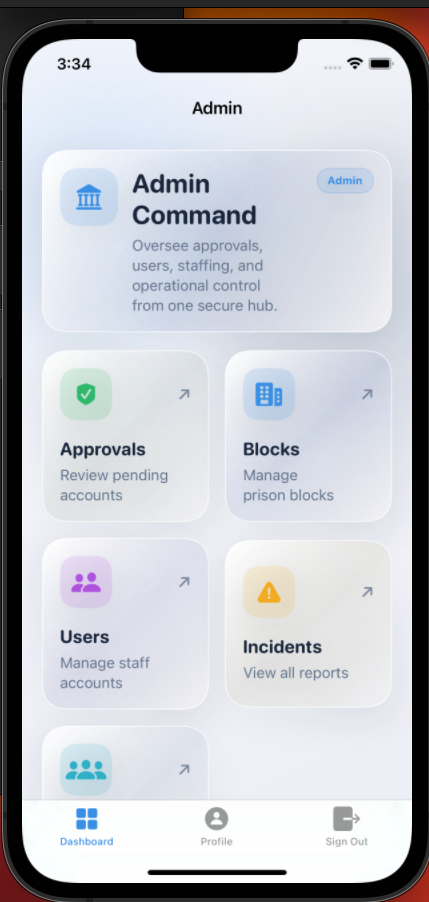
*Admin dashboard overview*

### Warden

The warden dashboard is designed for supervisory prison operations. It provides visibility across inmates, guards, incidents, medical status, and staff without exposing all administrative account control features.

Warden-facing capabilities include:

- viewing and managing inmate records
- reviewing guard assignments
- submitting incident reports
- reviewing incident history
- viewing medical status records in read-only mode
- managing prison staff records

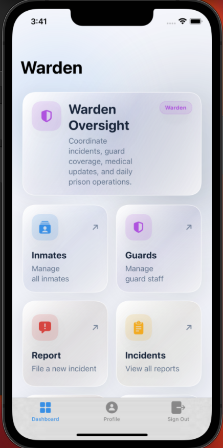
*Warden dashboard overview*

### Guard

The guard dashboard supports daily operational tasks at the ground level. It focuses on assigned inmates, incident reporting, duty visibility, and medical record handling within allowed access boundaries.

Guard-facing capabilities include:

- viewing inmates based on block assignment
- submitting incident reports
- reviewing incidents
- creating and updating medical records
- checking current duty status with live countdown logic
- maintaining personal profile details

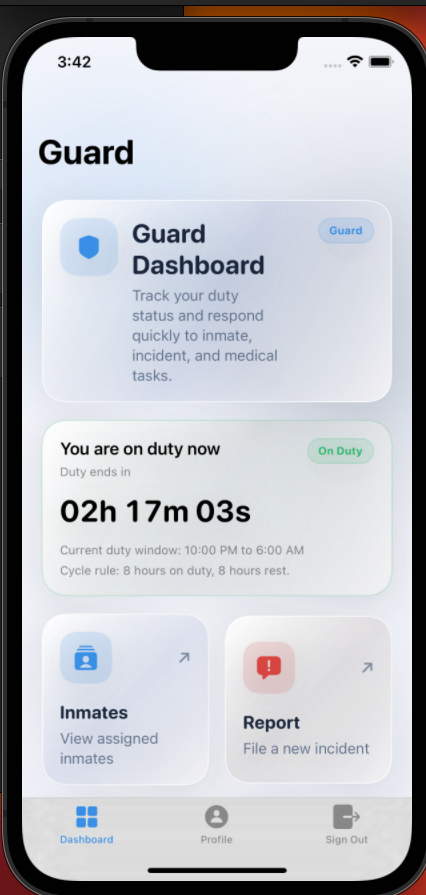
*Guard dashboard overview*

## Feature Modules and Workflows

### Authentication and Access Workflow

This workflow is used by all users who need to enter the system securely.

How the workflow works:

1. A user opens the app and lands on the login screen.
2. The user signs in with email and password, or uses saved credentials.
3. New users can create an account from the sign-up screen.
4. After authentication, the app checks the user profile and access status.
5. If the account is pending review, the system shows a pending approval screen instead of the main app.
6. If access is approved, the user is sent to the dashboard for their role.

What the system handles during this workflow:

- secure sign-in and sign-out
- account creation
- profile loading after authentication
- role-based routing
- approval-state gating
- device-level saved credential support

What the user can do afterward:

- enter the appropriate dashboard
- access role-specific prison management tools
- return to the profile page or sign out securely

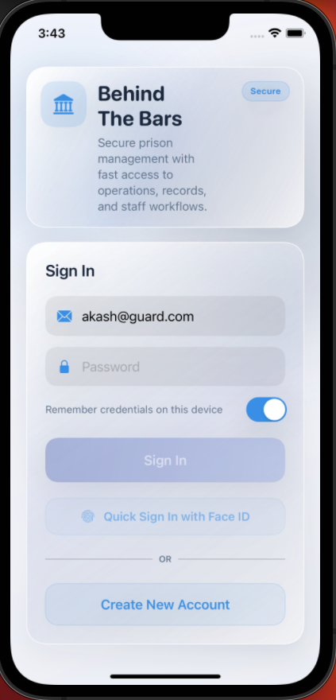
*Login screen*

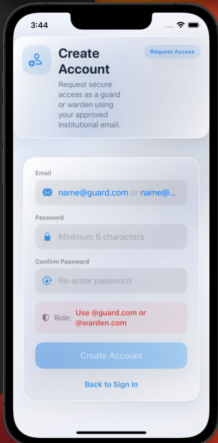
*Sign-up screen*

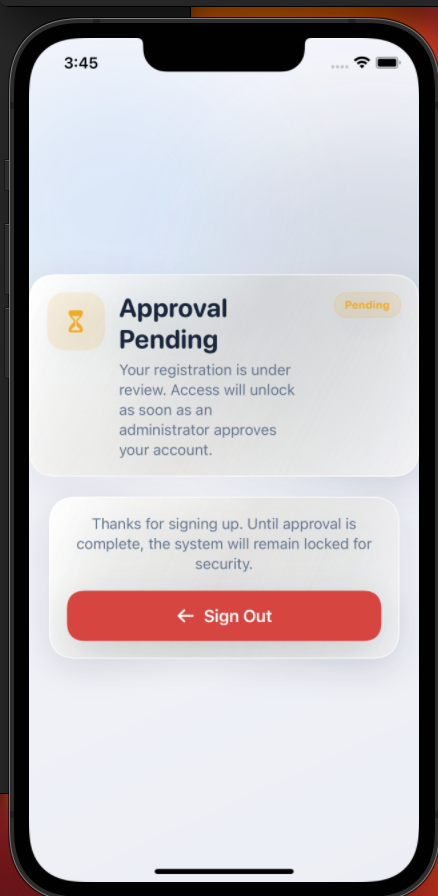
*Pending approval screen*

### Admin Panel Workflow

This workflow is used by administrators who oversee access control, structural setup, and system-wide user operations.

How the workflow works:

1. The admin enters the dashboard and chooses the required management area.
2. In the approvals area, the admin reviews pending accounts and approves or denies access.
3. In user management, the admin can search users, filter them by role or status, and update account details.
4. For guard accounts, the admin can maintain badge number, assigned block, approval status, and duty scheduling information.
5. In block management, the admin creates prison blocks and reviews the generated cells.
6. The admin can also enter incident and staff areas to monitor broader prison activity.

What information is entered or updated:

- account approval status
- user role and access state
- full name and badge number
- block assignment
- guard duty start information
- block creation data

What the system stores or updates:

- user account records in Firestore
- approval and status values for system access
- block records
- automatically generated cell records under each block

What the admin can view afterward:

- approved and pending user totals
- searchable user records
- prison block listings
- cell occupancy details
- incident records
- staff records

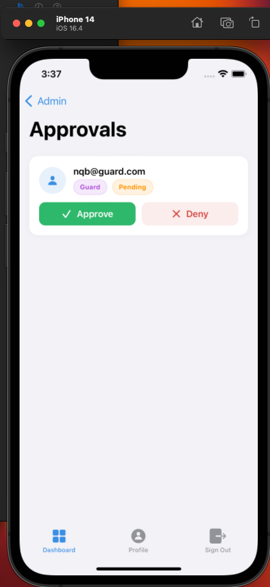
*Account approvals view*

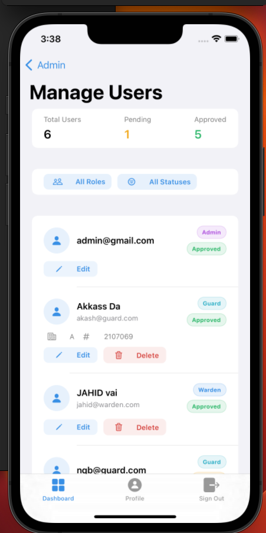
*User management view*

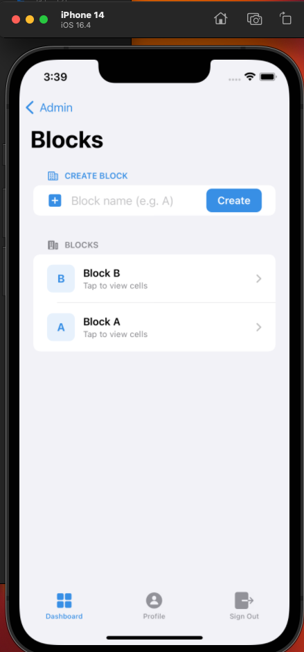
*Block and cell management view*

### Inmate Management Workflow

This workflow supports inmate admission, placement review, record browsing, and inmate detail inspection. It is primarily used by admins and wardens, while guards see only the inmates allowed by their assignment.

How the workflow works:

1. A user opens the inmate roster from the dashboard.
2. The list loads inmate records and displays searchable inmate cards.
3. Admins and wardens can start the inmate admission flow to create a new inmate record.
4. During admission, the user enters personal details, selects security level, chooses solitary status if needed, sets admission date, defines sentence duration, and selects a block and cell.
5. The system calculates the release date from the sentence length.
6. When an inmate is created, the selected cell occupancy is updated.
7. Existing inmate records can be opened to review placement, sentence timeline, and custody status.
8. Authorized users can edit or delete inmate records.

What information is entered or selected:

- first name and last name
- security level
- solitary confinement status
- admission date
- sentence duration in months
- block placement
- cell assignment

What the system stores or updates:

- inmate identity and housing information
- sentence duration and release date
- cell occupancy totals during admission and deletion
- updated inmate information when edited

What the user can view afterward:

- inmate roster filtered by assignment
- inmate detail screen
- security-level summary counts
- block and cell placement
- sentence timeline and release status

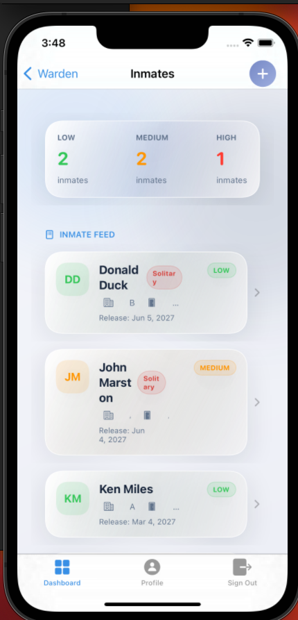
*Inmate list view*

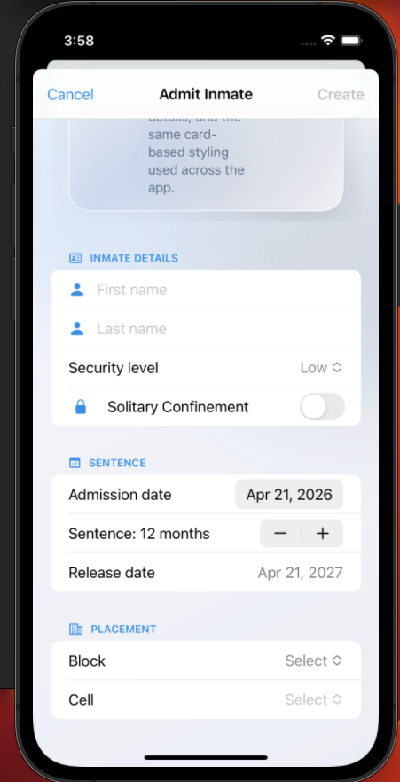
*Inmate admission screen*

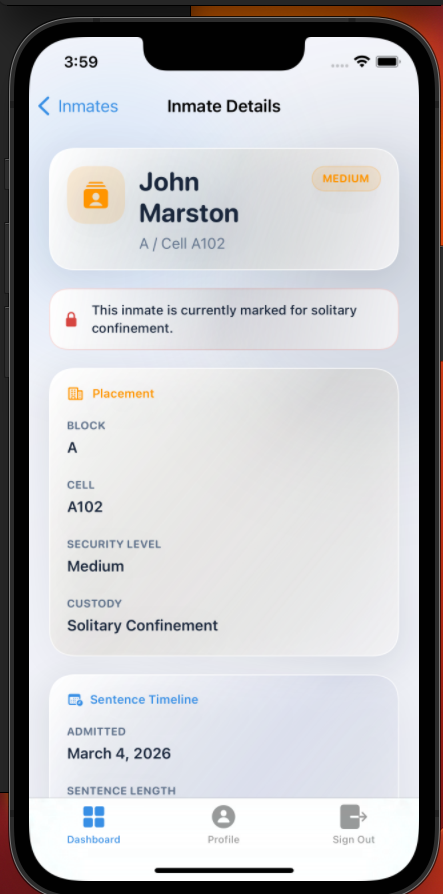
*Inmate detail view*

### Guard Management and Scheduling Workflow

This workflow is used to monitor guard assignments, badge information, block responsibility, and live duty timing.

How the workflow works:

1. A supervisor opens the guard directory from the dashboard.
2. The system loads guard user records from Firestore.
3. Each guard card displays assignment details such as name, email, badge number, and block placement.
4. Duty status is calculated from the guard's stored duty start value.
5. The interface shows whether a guard is currently on duty or off duty, along with a live countdown to the next change.
6. Authorized users can edit guard details and scheduling information when needed.

What information is entered or updated:

- full name
- badge number
- block assignment
- first duty start date and time

What the system stores or updates:

- guard identity fields
- assigned block
- duty anchor time
- shift-related scheduling data

What the user can view afterward:

- live guard duty status
- duty window timing
- assignment information by guard
- grouped guard scheduling information through dedicated schedule-related views in the project

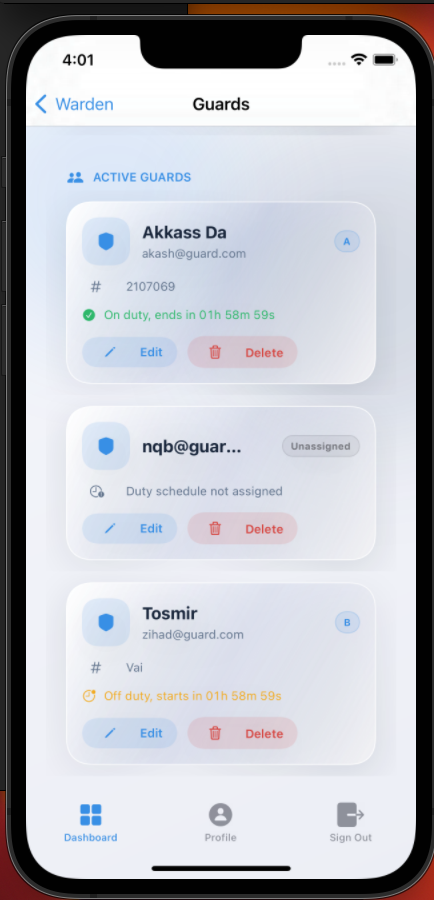
*Guard list view*

### Incident Reporting and Review Workflow

This workflow is used by operational staff to document prison incidents in a structured way and later review them.

How the workflow works:

1. A user opens the incident reporting area from the dashboard.
2. The user writes a description of the incident.
3. The user chooses a severity level.
4. The user selects the involved inmates from the inmate selection interface.
5. The user selects a penal code for the incident.
6. On submission, the system validates the report and stores it in Firestore.
7. The incident list can later be opened to review all submitted reports.
8. A single incident can be opened to inspect its full details, including severity, block, reporter, description, and involved inmates.

What information is entered or selected:

- incident description
- severity level
- involved inmates
- penal code

What the system stores or updates:

- incident record with reporter identity
- related block information
- involved inmate identifiers
- timestamp of submission
- severity and penal code details

What the user can view afterward:

- incident list
- severity-labelled reports
- detailed incident records
- reporter and inmate context for each incident

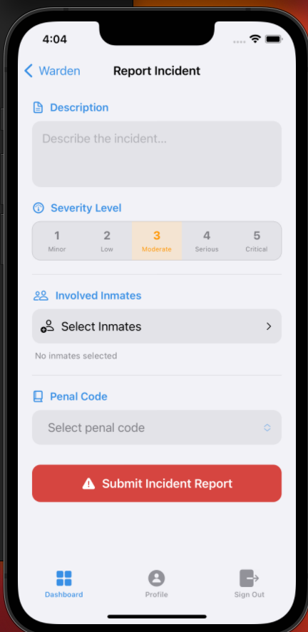
*Incident reporting form*

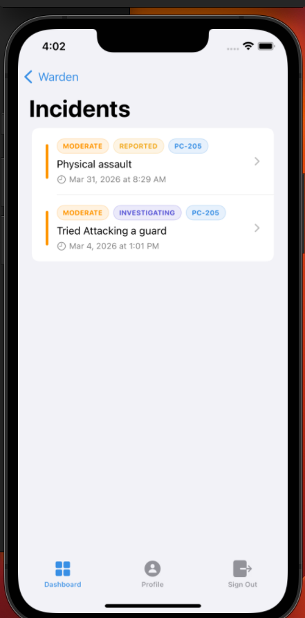
*Incident list view*

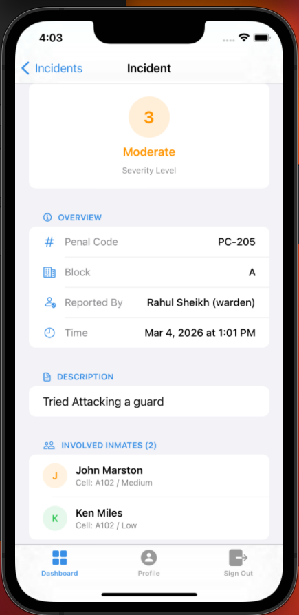
*Incident detail view*

### Medical Records Workflow

This workflow tracks inmate medical condition updates and treatment assignments. Guards manage records, while wardens review status in read-only form.

How the workflow works:

1. A user opens the medical area from the dashboard.
2. Guards can create a new medical record for an inmate within their allowed block access.
3. During record creation, the guard selects the inmate, assigns a doctor, writes a condition summary, adds treatment notes if needed, and sets the current medical status.
4. The record is saved to Firestore and appears in the medical record feed.
5. Existing records can be opened to review status details and timeline information.
6. Guards can edit or delete records they are allowed to manage.
7. Wardens can review the medical feed and record details without write access.

What information is entered or selected:

- inmate
- assigned doctor
- condition summary
- treatment notes
- medical status
- status date

What the system stores or updates:

- medical record details
- block association
- creation and update timestamps
- doctor and inmate linkage
- medical status history data used in current views

What the user can view afterward:

- searchable medical record feed
- record detail page
- doctor assignment
- inmate medical summary
- date-based status information

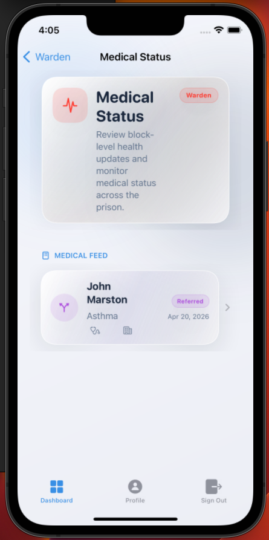
*Medical records list view*

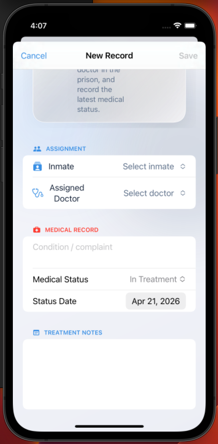
*Medical record editor view*

### Staff Management Workflow

This workflow manages non-guard prison staff such as doctors and other operational staff members.

How the workflow works:

1. A user opens the staff directory from the dashboard.
2. The list loads staff records and displays them in a searchable, filterable interface.
3. Staff can be filtered by type, shift group, and assigned block.
4. A new staff member can be added through the staff editor form.
5. During creation or editing, the user enters identity details, selects a staff type, chooses an assigned block, defines shift information, sets duty timing, and adds optional notes.
6. Existing staff records can be opened in a detail view for review.
7. Staff can be activated, deactivated, edited, or deleted from the management interface.

What information is entered or selected:

- full name
- phone number
- staff type
- assigned block
- shift group
- duty start timing
- hire date
- active status
- notes

What the system stores or updates:

- staff identity record
- block and shift assignment
- duty timing values
- status and activity state
- notes and timestamps

What the user can view afterward:

- searchable staff directory
- filtered staff lists
- individual staff detail view
- live duty status indicators
- activation status

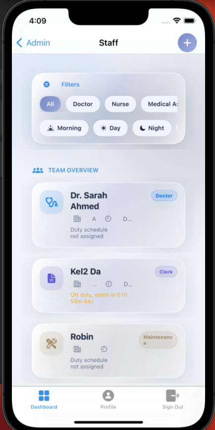
*Staff directory view*

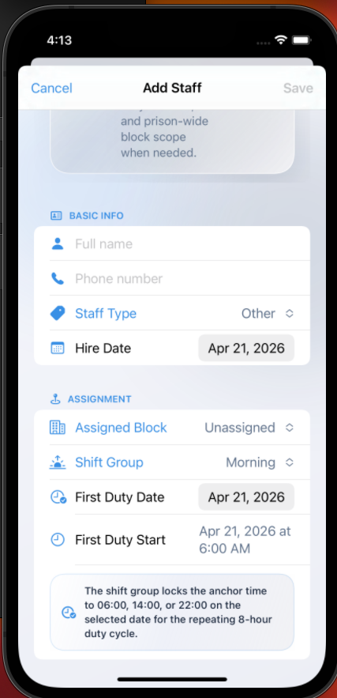
*Staff editor view*

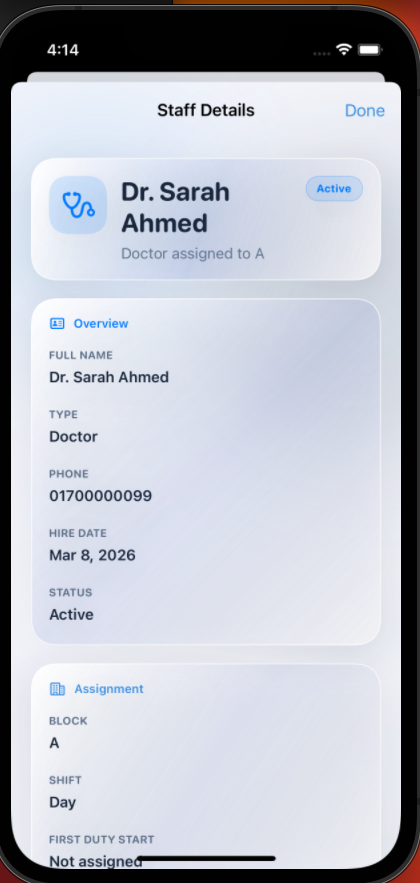
*Staff detail view*

### Profile Management Workflow

This workflow allows users to maintain personal account information that is visible inside the app.

How the workflow works:

1. The user opens the profile tab from the main interface.
2. The current account information is loaded into editable fields.
3. The user updates profile details such as full name or badge number.
4. The user saves the changes.
5. The app updates the Firestore user record and refreshes the current profile view.

What information is entered or updated:

- full name
- badge number

What the system stores or updates:

- user profile details inside the main user document

What the user can view afterward:

- account email
- role
- approval status
- assigned block visibility for guards
- updated personal details

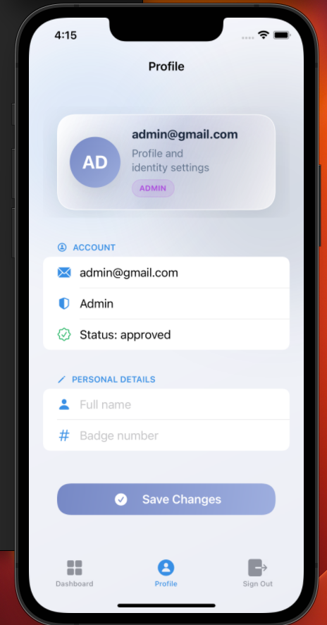
*Profile view*

## Project Structure

The repository is organized into feature-oriented SwiftUI layers:

```text
BehindTheBars/
|-- BehindTheBars/
|   |-- Views/
|   |-- ViewModels/
|   |-- Models/
|   |-- Services/
|   |-- Components/
|   |-- Resources/
|   `-- Assets.xcassets/
`-- BehindTheBars.xcodeproj/
```

### Main Directories

- `Views` contains the SwiftUI screens for authentication, dashboards, inmates, incidents, medical records, staff, admin tools, users, and profiles.
- `ViewModels` contains presentation logic, Firestore queries, listeners, and workflow coordination for each module.
- `Models` defines the main data structures used throughout the app, including users, inmates, incidents, medical records, staff, blocks, and cells.
- `Services` contains shared service logic such as Firebase access and JSON-based penal code loading.
- `Resources` includes bundled configuration and supporting data such as `GoogleService-Info.plist` and `penal_codes.json`.

## Setup and Run Instructions

To run the project locally:

1. Open `BehindTheBars.xcodeproj` in Xcode.
2. Allow Swift Package Manager to resolve the Firebase package dependencies.
3. Confirm that `GoogleService-Info.plist` is present inside the project resources and matches your Firebase project configuration.
4. In Firebase Console, make sure the required services are configured for this app, especially:
   - Firebase Authentication
   - Cloud Firestore
5. Check that Firestore rules are configured appropriately for your development environment.
6. Select an iOS simulator or a connected iPhone device supported by the project target.
7. Build and run the app from Xcode.

## Firebase Configuration Note

This project uses Firebase for authentication and cloud-hosted data storage. To use the project successfully, the Firebase setup must align with the app bundle and Firestore collections expected by the codebase.

The project currently depends on:

- Firebase Authentication for sign-in and account session handling
- Cloud Firestore for users, inmates, incidents, medical records, blocks, staff, and nested cell collections

Important configuration notes:

- `GoogleService-Info.plist` must correspond to the Firebase project you intend to use
- Firestore should contain the collections required by the app workflow
- authentication providers should be enabled according to the sign-in method you want to use
- Firestore security rules should match your intended access control model
